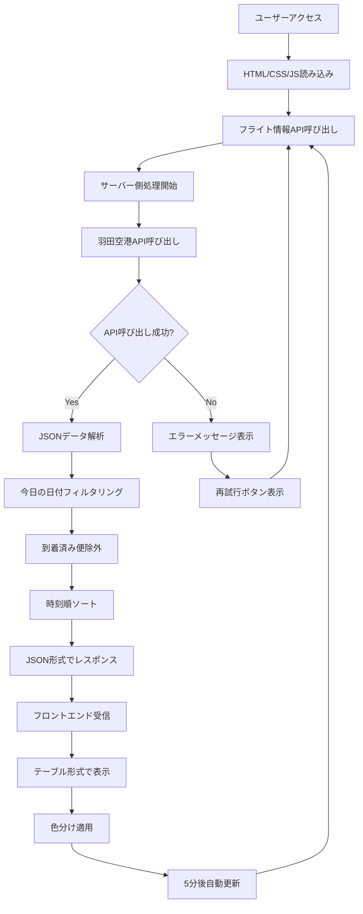
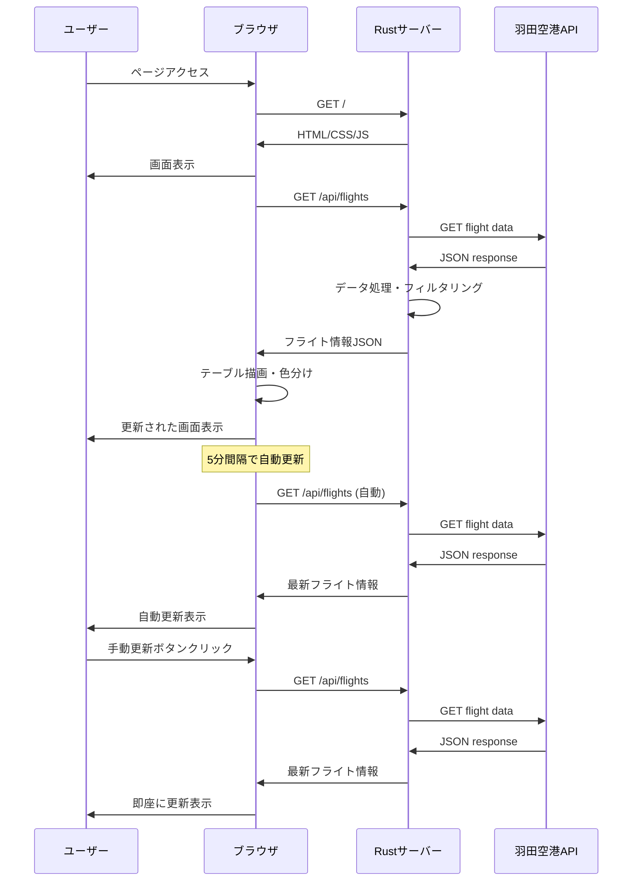
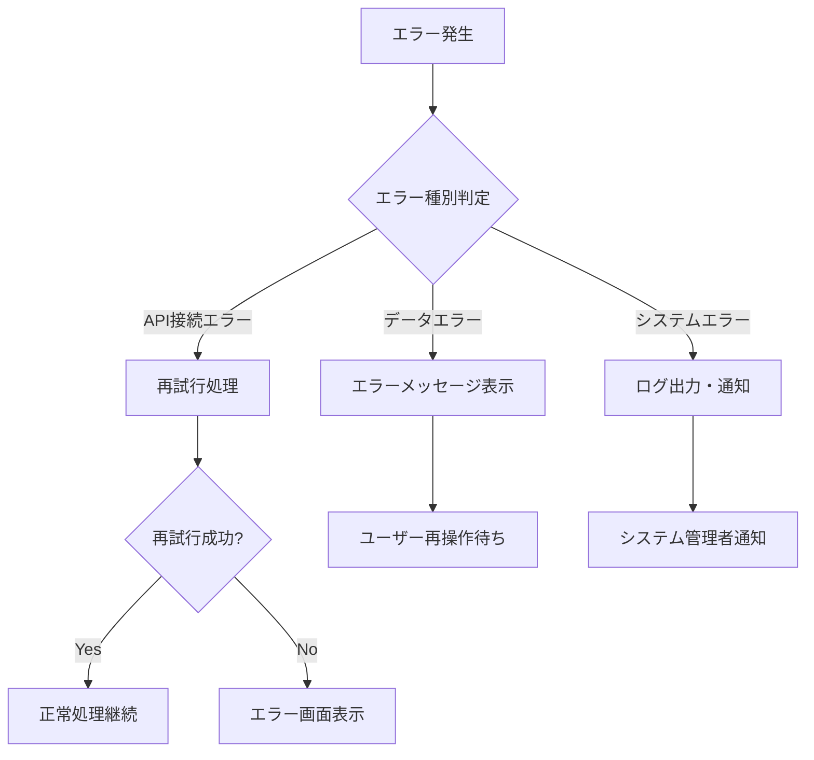

# 羽田空港到着便一覧システム仕様書

## 1. システム概要

### 1.1 プロジェクト名
羽田空港到着便一覧システム (Airport Arrivals List System)

### 1.2 システム概要
羽田空港の国際線到着便情報をリアルタイムで取得・表示し、ユーザーに視覚的に分かりやすい形で提供するWebアプリケーションシステムです。

### 1.3 目的
- 羽田空港の到着便情報を効率的に提供
- 運行状況による色分けで視認性向上
- レスポンシブデザインによるマルチデバイス対応
- リアルタイム更新による最新情報の提供

### 1.4 対象ユーザー
- 羽田空港を利用する旅客
- 出迎えを行う一般利用者
- 空港関係者
- 航空便情報を必要とする関係者

## 2. システム要件

### 2.1 機能要件

#### 2.1.1 基本機能
- **F001**: 羽田空港公式APIからの到着便情報取得
- **F002**: 今日の到着便のみフィルタリング表示
- **F003**: 運行状況別の色分け表示
- **F004**: ターミナル別の色分け表示
- **F005**: 到着時刻による自動ソート機能
- **F006**: 5分間隔での自動更新機能
- **F007**: 手動更新機能
- **F008**: レスポンシブデザイン対応
- **F009**: ヘルスチェック機能

#### 2.1.2 表示情報
| 項目 | 説明 | 表示形式 |
|------|------|----------|
| 運行状況 | 到着、遅延、手荷物引渡中、欠航等 | 色分けバッジ |
| 到着時刻 | 実際の到着予定時刻 | HH:MM形式 |
| 出発地 | 出発地空港名 | テキスト |
| 機種 | 航空機種別コード | テキスト |
| ターミナル | 到着ターミナル番号 | 色分けバッジ |

### 2.2 非機能要件

#### 2.2.1 性能要件
- **P001**: APIレスポンス時間 < 3秒
- **P002**: 画面初期表示時間 < 2秒
- **P003**: 同時接続ユーザー数 100名まで対応

#### 2.2.2 可用性要件
- **A001**: システム稼働率 95%以上
- **A002**: 外部API障害時のエラーハンドリング

#### 2.2.3 セキュリティ要件
- **S001**: HTTPSによる通信（本番環境）
- **S002**: 入力値検証の実装
- **S003**: ログによる操作記録

#### 2.2.4 互換性要件
- **C001**: Chrome, Firefox, Safari, Edge 最新版対応
- **C002**: スマートフォン・タブレット対応
- **C003**: 画面解像度 320px以上対応

## 3. システムアーキテクチャ

### 3.1 全体構成図

```
┌─────────────────┐    ┌─────────────────┐    ┌─────────────────┐
│                 │    │                 │    │                 │
│   Web Browser   │◄──►│  Rust Web App   │◄──►│ Haneda API      │
│   (Frontend)    │    │  (Backend)      │    │ (External)      │
│                 │    │                 │    │                 │
└─────────────────┘    └─────────────────┘    └─────────────────┘
         │                       │
         │                       │
    ┌────▼────┐            ┌─────▼─────┐
    │ HTML    │            │ Static    │
    │ CSS     │            │ Files     │
    │ JS      │            │ Server    │
    └─────────┘            └───────────┘
```

### 3.2 システム構成

#### 3.2.1 バックエンド構成
```
src/
├── main.rs          # アプリケーションエントリーポイント
├── handlers.rs      # HTTPリクエストハンドラー
├── services.rs      # ビジネスロジック・外部API連携
└── models.rs        # データモデル定義
```

#### 3.2.2 フロントエンド構成
```
static/
├── index.html       # メイン画面
└── css/
    └── style.css    # スタイルシート
```

### 3.3 技術スタック

#### バックエンド
- **言語**: Rust 1.70+
- **Webフレームワーク**: Actix-web 4.11.0
- **HTTPクライアント**: Reqwest 0.11
- **シリアライゼーション**: Serde 1.0
- **日時処理**: Chrono 0.4
- **ログ**: env_logger 0.10

#### フロントエンド
- **マークアップ**: HTML5
- **スタイル**: CSS3 (Flexbox, Grid)
- **スクリプト**: JavaScript ES6+
- **フォント**: Google Fonts (Noto Sans JP)
- **アイコン**: Font Awesome 6.4.0

## 4. データフロー

### 4.1 フローチャート



### 4.2 シーケンス図



## 5. API仕様

### 5.1 内部API仕様

#### 5.1.1 フライト情報取得API
- **エンドポイント**: `GET /api/flights`
- **説明**: 今日の到着便情報を取得
- **レスポンス形式**: JSON

**レスポンス例**:
```json
[
  {
    "flight_status": "到着",
    "arrival_time": "14:30",
    "place_of_departure": "ソウル(仁川)",
    "aircraft_code": "B738",
    "terminal": "2"
  },
  {
    "flight_status": "遅延",
    "arrival_time": "15:45",
    "place_of_departure": "台北(桃園)",
    "aircraft_code": "A321",
    "terminal": "3"
  }
]
```

#### 5.1.2 ヘルスチェックAPI
- **エンドポイント**: `GET /health`
- **説明**: システム稼働状況確認
- **レスポンス形式**: JSON

**レスポンス例**:
```json
{
  "status": "healthy",
  "timestamp": "2024-07-25T10:30:00+09:00"
}
```

### 5.2 外部API仕様

#### 5.2.1 羽田空港公式API
- **URL**: `https://tokyo-haneda.com/app_resource/flight/data/int/hdacfarv.json`
- **メソッド**: GET
- **説明**: 国際線到着便情報
- **更新頻度**: リアルタイム

## 6. データモデル

### 6.1 内部データ構造

```rust
// フライト情報構造体
pub struct Flight {
    pub flight_status: String,      // 運行状況
    pub arrival_time: String,       // 到着時刻
    pub place_of_departure: String, // 出発地
    pub aircraft_code: String,      // 機種コード
    pub terminal: String,           // ターミナル
}

// 外部APIレスポンス構造体
pub struct FlightApiResponse {
    pub flight_info: Option<Vec<FlightData>>,
}

// 外部APIデータ構造体
pub struct FlightData {
    pub note_jp: Option<String>,           // 備考（日本語）
    pub scheduled_time: Option<String>,    // 定刻
    pub changed_time: Option<String>,      // 変更時刻
    pub note_status: Option<FlightStatus>, // 運行状況
    pub departure_airport: Option<String>, // 出発地空港
    pub aircraft_code: Option<String>,     // 機種コード
    pub terminal: Option<String>,          // ターミナル
}
```

## 7. ユーザーインターフェース

### 7.1 画面構成

#### 7.1.1 メイン画面
```
┌─────────────────────────────────────────────────┐
│ 🛩️ 羽田空港 到着便一覧               [🔄更新] │
│ 最終更新: 14:30:15                            │
├─────────────────────────────────────────────────┤
│ 🛈 運行状況の見方                              │
│ [到着] [手荷物引渡中] [遅延] [欠航]             │
├─────────────────────────────────────────────────┤
│ 運行状況│到着時刻│出発地    │機種 │ターミナル  │
├─────────┼────────┼─────────┼─────┼──────────┤
│ [到着]  │ 14:30  │ソウル(仁川)│B738 │    [2]   │
│ [遅延]  │ 15:45  │台北(桃園) │A321 │    [3]   │
│ [手荷物]│ 16:20  │上海(浦東) │B787 │    [2]   │
└─────────┴────────┴─────────┴─────┴──────────┘
```

### 7.2 色分け仕様

#### 7.2.1 運行状況色分け
| 状況 | 背景色 | 文字色 | 説明 |
|------|--------|--------|------|
| 到着 | #00ff00 | #000000 | 到着済み |
| 手荷物引渡中 | #ffff00 | #000000 | 手荷物引渡し中 |
| 遅延 | #fcccbe | #000000 | 遅延発生 |
| 欠航 | #ff0000 | #ffffff | 便の欠航 |
| その他 | #ffffff | #000000 | 通常状態 |

#### 7.2.2 ターミナル色分け
| ターミナル | 背景色 | 文字色 |
|------------|--------|--------|
| 2 | #0082f0 | #ffffff |
| 3 | #00afbd | #ffffff |
| その他 | #ffffff | #000000 |

## 8. エラーハンドリング

### 8.1 エラー分類

#### 8.1.1 システムエラー
- **E001**: 外部API接続エラー
- **E002**: データ解析エラー
- **E003**: サーバー内部エラー

#### 8.1.2 ユーザーエラー
- **E004**: ネットワーク接続エラー
- **E005**: ブラウザ互換性エラー

### 8.2 エラー処理フロー



## 9. セキュリティ

### 9.1 セキュリティ対策

#### 9.1.1 入力検証
- APIレスポンスの型安全性チェック
- 不正データの除外処理
- エスケープ処理の実装

#### 9.1.2 通信セキュリティ
- HTTPS通信（本番環境）
- CORS設定の適切な構成
- APIキーの環境変数管理

#### 9.1.3 ログ・監視
- アクセスログの記録
- エラーログの保存
- 異常検知機能

## 10. 運用・保守

### 10.1 運用要件

#### 10.1.1 稼働時間
- **平日**: 24時間稼働
- **休日**: 24時間稼働
- **メンテナンス**: 月1回（深夜時間帯）

#### 10.1.2 監視項目
- システム稼働状況
- API応答時間
- エラー発生率
- アクセス数

### 10.2 保守項目

#### 10.2.1 定期保守
- ログファイルのローテーション
- 依存関係のアップデート
- セキュリティパッチの適用

#### 10.2.2 障害対応
- 障害検知から1時間以内の初期対応
- 復旧作業の実施
- 障害報告書の作成

## 11. 今後の拡張予定

### 11.1 機能拡張
- **F101**: 国内線対応
- **F102**: 出発便情報表示
- **F103**: フライト検索機能
- **F104**: お気に入り機能
- **F105**: 通知機能
- **F106**: 多言語対応

### 11.2 技術的改善
- **T101**: データベース導入
- **T102**: キャッシュ機能実装
- **T103**: WebSocket対応
- **T104**: PWA対応
- **T105**: Docker化

## 12. 付録

### 12.1 開発環境
- **OS**: Windows 11 / macOS / Linux
- **Rust**: 1.70以上
- **エディタ**: VS Code
- **ブラウザ**: Chrome 最新版（開発用）

### 12.2 デプロイメント
- **開発環境**: localhost:8080
- **テスト環境**: test.example.com
- **本番環境**: production.example.com

### 12.3 参考資料
- [Actix-web公式ドキュメント](https://actix.rs/)
- [Rust公式ドキュメント](https://doc.rust-lang.org/)
- [羽田空港公式サイト](https://www.tokyo-haneda.com/)

---

**文書作成日**: 2024年7月25日  
**文書バージョン**: 1.0  